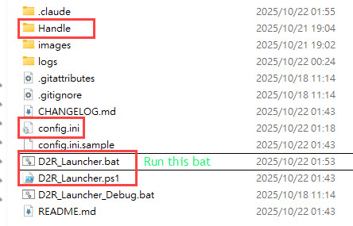
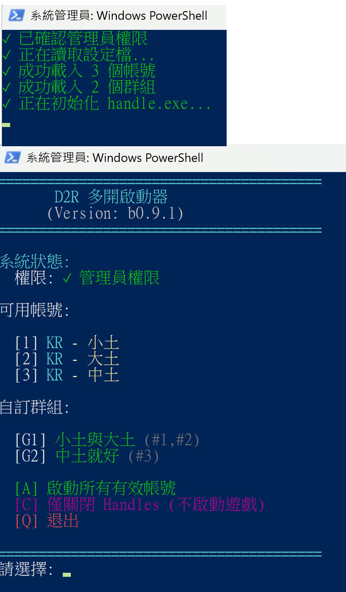

# D2R 多開工具 (v b0.9.2)

> **使用者文件**：快速了解如何使用本工具
> 技術細節請參閱 [CLAUDE.md](./CLAUDE.md) | 版本歷程請參閱 [CHANGELOG.md](./CHANGELOG.md)

使用 handle.exe 繞過 D2R 的多開檢查機制，實現同時運行多個遊戲實例並自動登入。

---

## 快速開始

### 1. 下載必要工具
- 前往 [Sysinternals Handle 下載頁面](https://learn.microsoft.com/en-us/sysinternals/downloads/handle)
- 下載 Handle.zip 並解壓縮
- 在專案資料夾下建立 `Handle` 資料夾
- 將 `handle64.exe` 放到 `Handle` 資料夾內（預設路徑：`.\Handle\handle64.exe`）

### 2. 設定腳本
編輯 `config.ini` 設定檔：

```ini
[Paths]
# Handle.exe 路徑（相對或絕對路徑）
HandleExePath=Handle\handle64.exe
# Handle.exe 輸出的臨時檔案路徑
TempFilePath=Handle\handles_temp.txt
# D2R 遊戲執行檔路徑
D2RGamePath=D:\Diablo II Resurrected\D2R.exe

[General]
# 預設伺服器 (us, eu, kr) - 當帳號未指定時使用
DefaultServer=kr
# 預設啟動參數 - 當帳號未指定時使用
DefaultLaunchArgs=-mod YourMod -txt -w
# 遊戲視窗初始化等待時間 (秒)
WindowInitDelay=3

[Account1]
Username=your_email@example.com
Password=your_password
DisplayName=帳號暱稱
Server=kr  # 可留空使用 DefaultServer
LaunchArgs=-mod YourMod -txt -w  # 可留空使用 DefaultLaunchArgs

# 新增更多帳號，依序編號 Account2, Account3...

# 群組設定 (選填)
[Group1]
DisplayName=全部帳號
Accounts=1,2,3  # 要啟動的帳號編號，用逗號分隔
```

### 3. 執行

#### 方法一：使用 BAT 檔案啟動（推薦）
- **一般模式**：雙擊執行 `D2R_Launcher.bat`
- **除錯模式**：雙擊執行 `D2R_Launcher_Debug.bat`

#### 方法二：直接執行 PowerShell 腳本
- 右鍵點擊 `D2R_Launcher.ps1` → 選擇「使用 PowerShell 執行」
- **注意**：某些系統可能因為執行策略限制而無法直接執行 PS1 檔案

#### 重要提示
- **自動提權**：腳本會自動檢測並請求管理員權限
- 無需手動右鍵選擇「以系統管理員身分執行」
- **推薦使用 BAT 檔案**：避免視窗閃退問題

**除錯模式**（可選）：
- 執行 `D2R_Launcher_Debug.bat` 或使用 `powershell -File D2R_Launcher.ps1 -Debug`
- 除錯模式會顯示帳號、密碼長度等額外診斷資訊
- 僅在需要排查問題時使用

## 功能特色

- ✅ **自動提權**：腳本自動檢測並請求管理員權限，無需手動操作
- ✅ **外部設定檔**：使用 `config.ini` 管理所有設定，更新方便
- ✅ **自動登入**：遊戲啟動後自動填入帳號密碼
- ✅ **多開支援**：自動關閉實例檢查，可同時運行多個帳號
- ✅ **視窗標題自訂**：每個遊戲視窗顯示「D2R: 編號 - 顯示名稱」，方便識別
- ✅ **互動式選單**：選擇單一帳號、群組或啟動全部
- ✅ **群組功能**：自訂帳號組合，一鍵啟動特定帳號群組
- ✅ **伺服器選擇**：支援 US/EU/KR 伺服器，可設定預設值
- ✅ **彈性設定**：Server 和 LaunchArgs 可選填，自動使用預設值
- ✅ **參數化等待時間**：可自訂視窗初始化等待時間
- ✅ **優化啟動流程**：先關閉 handle 再啟動，提升效率
- ✅ **MOD 支援**：可自訂 MOD 和啟動參數
- ✅ **日誌記錄**：記錄操作但不記錄敏感資訊（使用 Mutex 避免衝突）
- ✅ **相對路徑支援**：Handle.exe 可使用相對路徑，方便移植
- ✅ **除錯模式**：使用 `-Debug` 參數顯示額外診斷資訊，平常不顯示敏感資料
- ✅ **自動解除封鎖**：BAT 啟動器自動處理從 GitHub 下載的檔案封鎖問題

## 使用說明

### 選單選項
- **[1 - N]** - 啟動指定帳號（顯示格式：`[編號] 伺服器 - 顯示名稱`）
- **[G1 - GN]** - 啟動指定群組（顯示包含的帳號編號）
- **[A]** - 啟動所有帳號
- **[C]** - 只關閉 Handles（不啟動遊戲）
- **[Q]** - 退出

### 運作流程
1. 先檢查並關閉實例檢查 handle（如果有）
2. 啟動遊戲並自動登入
3. 等待指定秒數讓遊戲初始化（可在 config.ini 設定）
4. 設定視窗標題為「D2R: 編號 - 顯示名稱」
5. 繼續啟動下一個實例

## 技術原理

### 自動提權機制
腳本啟動時會自動檢測當前權限：
1. 使用 `WindowsIdentity` 和 `WindowsPrincipal` 檢測是否為管理員
2. 若無管理員權限，自動以管理員身分重新啟動腳本
3. 避免使用者手動操作，提升使用體驗

### Handle 關閉機制
D2R 使用名為 "Check For Other Instances" 的 handle 來檢測其他實例。本工具：
1. 使用 handle64.exe 掃描該 handle
2. 使用 tokens=3,6 方法解析進程 ID 和 handle ID
3. 關閉該 handle 以允許多開

**優化**：改為啟動前先關閉 handle，提升啟動效率（第一個遊戲沒有 handle，直接跳過）

### 視窗標題設定
使用 Windows API 來設定遊戲視窗標題：
1. 啟動遊戲前先記錄所有現有的 D2R 視窗
2. 使用 `EnumWindows` 列舉所有視窗
3. 找出新出現的 D2R 視窗
4. 使用 `SetWindowText` API 設定自訂標題

### 支援的啟動參數
- `-username <email>` - 自動填入帳號
- `-password <password>` - 自動填入密碼
- `-address <server>` - 指定伺服器（us/eu/kr.actual.battle.net）
- `-mod <modname>` - 載入 MOD
- `-txt` - txt 檔讀取模式
- `-w` - 視窗模式
- `-ns` - 靜音

## 注意事項

### 安全性
- ⚠️ 帳號密碼以明文儲存在 `config.ini` 中，請妥善保管此檔案
- 日誌不記錄密碼，並自動遮罩 email 帳號（v0.9.2+）
  - 範例：`test@example.com` → `t***@example.com`
- 建議不要將 `config.ini` 上傳至公開的版本控制系統
- 僅供個人學習測試，請遵守遊戲服務條款

### 系統需求
- Windows 系統（繁體中文環境）
- PowerShell 5.0 以上
- 腳本會自動請求管理員權限（無需手動提權）

### 檔案編碼
- **PowerShell 腳本 (.ps1)**：使用 **UTF-8 with BOM** 編碼
- **設定檔 (config.ini)**：使用 **UTF-8** 編碼
- 如需修改檔案，請確保編輯器使用正確的編碼格式儲存

## 檔案結構

```
D2R-Multi-Instance/
├── D2R_Launcher.ps1                  # 主程式腳本
├── D2R_Launcher.bat                  # 一般模式啟動器（推薦）
├── D2R_Launcher_Debug.bat            # 除錯模式啟動器
├── config.ini                        # 設定檔（帳號、路徑、參數）
├── config.ini.sample                 # 設定檔範本
├── CHANGELOG.md                      # 版本更新日誌
├── Handle/                           # Handle 工具資料夾
│   ├── handle64.exe                  # Handle 執行檔
│   └── handles_temp.txt              # 臨時檔案（自動生成）
├── logs/                             # 日誌目錄（自動建立）
│   └── D2R_Launch_YYYYMMDD.log      # 每日日誌
├── images/                           # 截圖目錄
└── README.md                         # 說明文件
```

## 更新日誌

詳細版本更新記錄請查看 [CHANGELOG.md](./CHANGELOG.md)

## 截圖展示

### 啟動畫面


### 主選單


### 執行結果

